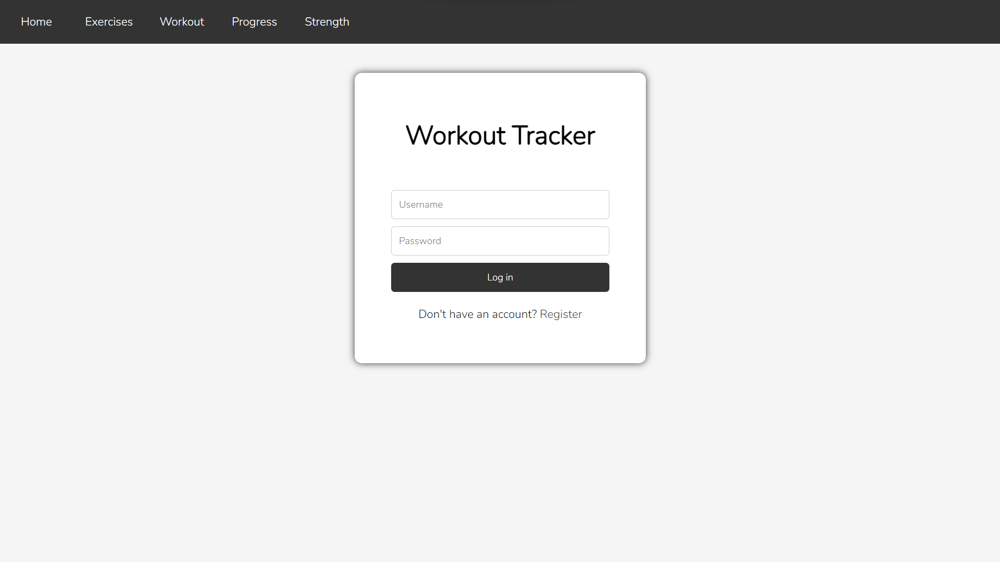
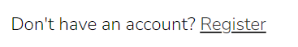
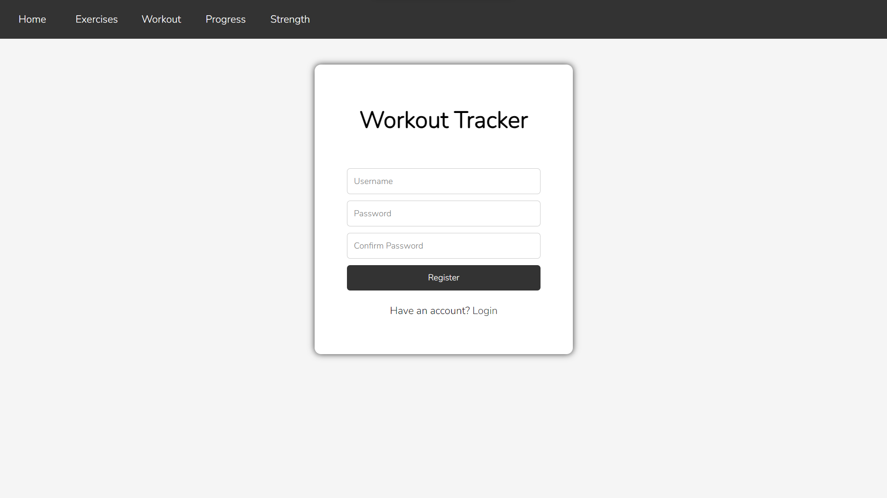

# Flask Workout Tracker

A simple web application built with Flask for tracking workouts.

## Table of Contents

- [Introduction](#introduction)
- [Installation](#installation)
- [Running the program](#running-the-program)
- [Features](#features)
- [Usage](#usage)
   - [Login and Register](#login-and-register)
   - [Home page](#home-page)
   - [Exercise list](#exercise-list)
   - [Tracking your workout](#tracking-your-workout)
   - [Additional Information](#additional-information)
- [Contributing](#contributing)
- [License](#license)

## Introduction

This Flask Workout Tracker is designed to help users keep track of their workouts. It allows users to register, log in, and record their workouts along with exercises performed.

## Installation

1. Clone the repository:
   ```bash
   git clone https://github.com/MichalDakowicz/workout-tracker.git
   ```
2. Navigate to the project directory:
   ```bash
   cd workout-tracker
   ```
3. Install the dependencies:
   ```bash
   pip install -r requirements.txt
   ```

## Running the program

1. Run the Flask application:
   ```bash
   python app.py
   ```
2. Open your web browser and go to http://localhost:5000.

3. You can register a new account, log in, and start tracking your workouts.

## Features

- User authentication: Register and log in securely.
- Record and view workouts with date and exercises performed.
- More comming soon.


## Usage

#### Login and Register

When you launch the application and navigate to the website, you'll encounter a login form. To log in, enter your username and password, then click the login button.


If you're new to the platform, click the register button located below the login form. 

You'll be directed to the registration page where you can choose a username and password. 

Confirm your password by entering it again, then click the register button to complete the registration process. Once registered, you'll be redirected to the login page where you can proceed to log in.

Alternatively, while on the registration page, you can switch back to the login form by clicking the login text below the registration form.


#### Home Page

Upon successful login, you'll be directed to the home page. Here, you'll find a concise overview of your past training sessions.

#### Exercise List

To access the list of exercises, click the *"Exercises"* button at the top of the page. You'll be taken to a webpage where exercises are categorized by muscle group, along with specific muscle targeting information.

#### Tracking Your Workout

Navigate to the *"Workout"* page by clicking the corresponding button on the top navigation bar. Here, you can track your workout sessions.

1. Select an exercise from the list.

2. Input the number of sets and click *"Confirm"*.

3. Enter the number of reps and weight for each set.

   **Please note: Ensure all fields are accurately filled out before saving your workout.**

4. Click *"Confirm"* to add the exercise to your workout.

5. Repeat the process for each exercise you wish to include.

6. Once finished, click the *"Save"* button at the bottom of the list to record your workout.

#### Additional Information

Please note that any unsaved changes made on the *"Workout"* page will not be retained once you leave the page.

To return to the home page at any time, simply click the *"Home"* button located at the top of the page. This will swiftly redirect you back to the home page, allowing for seamless navigation throughout the application.

## Contributing

Contributions are welcome! If you'd like to contribute to this project, please follow these steps:

1. Fork the repository.
2. Create a new branch:
   ```bash
   git checkout -b feature-branch
   ```
3. Make your changes.
4. Commit your changes: 
   ```bash
   git commit -am 'Add new feature'
   ```
5. Push to the branch:
   ```bash
   git push origin feature-branch
   ```
6. Create a new pull request.

## License

This project is licensed under the **[MIT License](LICENSE)**