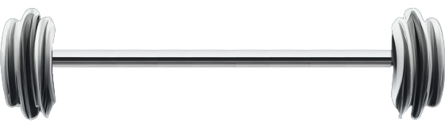
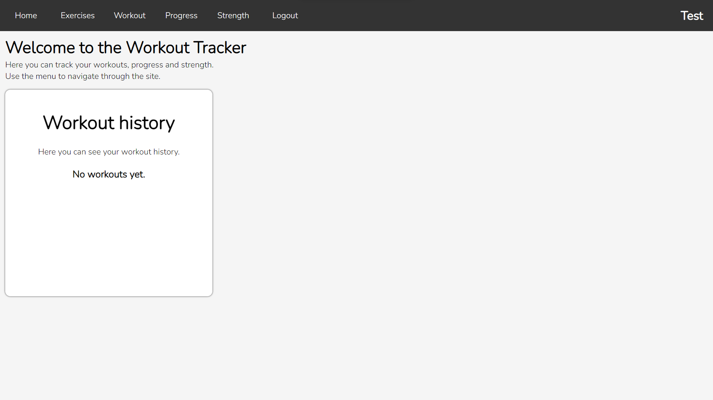
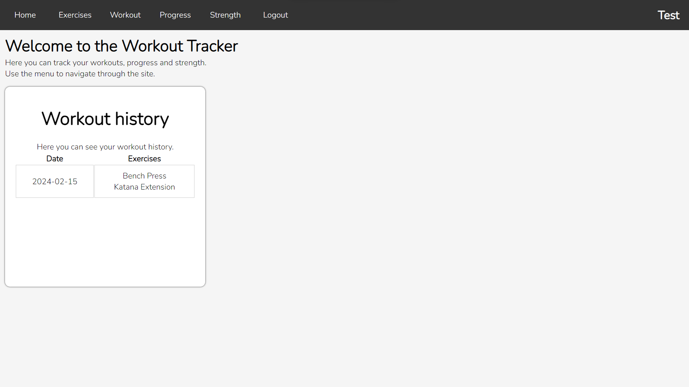
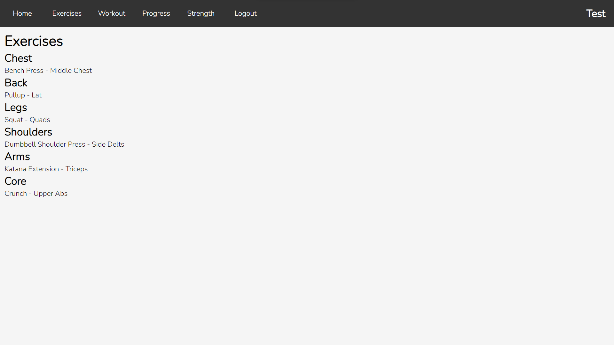

<div align="center" id="top"> 
  

&#xa0;

</div>

<h1 align="center">Workout Tracker</h1>

<p align="center" >
    
</p>

<h4 align="center">
	🚧  Workout Tracker 💪 Under construction...  🚧
</h4>

<div align="center">
    A simple web application built with Flask for tracking workouts measuring strength and much more.
</div>

<hr>

## Table of Contents

-   [Introduction](#introduction)
-   [Installation](#installation)
-   [Running the program](#running-the-program)
-   [Features](#features)
    -   [Feature Requests](#feature-requests)
    -   [Feature Plans](#feature-plans)
-   [Usage](#usage)
    -   [Login and Register](#login-and-register)
    -   [Home Page](#home-page)
    -   [Exercise List](#exercise-list)
    -   [Tracking Your Workout](#tracking-your-workout)
    -   [Strength Tracking](#strength-tracking)
    -   [Additional Information](#additional-information)
-   [Contributing](#contributing)
-   [Issues](#issues)
-   [License](#license)

FOR TECHNICAL DOCUMENTATION GO [HERE](TECHNICAL.md)

## Introduction

This Flask Workout Tracker is designed to help users keep track of their workouts. It allows users to register, log in, and record their workouts along with exercises performed.

## Installation

1. Clone the repository:
    ```bash
    git clone https://github.com/MichalDakowicz/workout-tracker.git
    ```
2. Navigate to the project directory:
    ```bash
    cd workout-tracker
    ```
3. Install the dependencies:
    ```bash
    pip install -r requirements.txt
    ```

## Running the program

1. Run the Flask application:
    ```bash
    python app.py
    ```
2. Open your web browser and go to http://localhost:5000 or http://127.0.0.1:5000.

## Features

-   User authentication: Register and log in securely.
-   Record and view workouts with date and exercises performed.
-   Strength tracking (currently broken)
-   More coming soon.

#### Feature Requests

Have a suggestion or want to see a new feature added? Your input is invaluable! Visit GitHub Issues to create a new issue, and mark it as an _"enhancement"_ request. I'll review your proposal with enthusiasm!

#### Feature Plans

For now the project is in early development so i cant write anything here yet.

<!-- Future Plans: If you have a roadmap for additional features, include a section titled "" or "Future Development" to let users know what they can look forward to. -->

## Usage

#### Login and Register

When you launch the application and navigate to the website, you'll encounter a login form. To log in, enter your username and password, then click the login button.

<br>


_picture of the login page with the login form_

If you're new to the platform, click the register button located below the login form.

<br>


_picture of the register button_

You'll be directed to the registration page where you can choose a username and password.

<br>


_picture of the register page with the register form_

Confirm your password by entering it again, then click the register button to complete the registration process. Once registered, you'll be redirected to the login page where you can proceed to log in.

Alternatively, while on the registration page, you can switch back to the login form by clicking the login text below the registration form.

<br>


_picture of the login button_

#### Home Page

Upon successful login, you'll be directed to the home page. Here, you'll find a concise overview of your past training sessions.

<br>


_picture of the home screen with the workout history panel_

When you do a workout it will display a simple overview of it inside the _"Workout history"_ panel.

<br>


_picture of the home screen with the workout history panel with a workout_

#### Exercise List

To access the list of exercises, click the _"Exercises"_ button at the top of the page. You'll be taken to a webpage where exercises are categorized by muscle group, along with specific muscle targeting information.

<br>


_picture of the exercise list (not the whole list added yet)_

#### Tracking Your Workout

Navigate to the _"Workout"_ page by clicking the corresponding button on the top navigation bar. Here, you can track your workout sessions.

1. Select an exercise from the list.

2. Input the number of sets and click _"Confirm"_.

3. Enter the number of reps and weight for each set.

    **Please note: Ensure all fields are accurately filled out before saving your workout.**

4. Click _"Confirm"_ to add the exercise to your workout.

5. Repeat the process for each exercise you wish to include.

6. Once finished, click the _"Save"_ button at the bottom of the list to record your workout.

#### Strength Tracking

On this dedicated page, diligently input all relevant data into the provided form. After entering the necessary information, click the _"Confirm"_ button to process your input. Subsequently, you'll witness your results meticulously displayed as a comprehensive strength level analysis.

#### Additional Information

Please note that any unsaved changes made on the _"Workout"_ page will not be retained once you leave the page.

To return to the home page at any time, simply click the _"Home"_ button located at the top of the page. This will swiftly redirect you back to the home page, allowing for seamless navigation throughout the application.

## Contributing

Contributions are welcome! If you'd like to contribute to this project, please follow these steps:

1. Fork the repository.
2. Create a new branch:
    ```bash
    git checkout -b feature-branch
    ```
3. Make your changes.
4. Commit your changes:
    ```bash
    git commit -am 'Add new feature'
    ```
5. Push to the branch:
    ```bash
    git push origin feature-branch
    ```
6. Create a new pull request.

## Issues

Encountered a bug or have an issue with the application? Please head to GitHub Issues and click on the _"New Issue"_ button. Specify your problem in detail, and make sure to select _"bug"_ as the label. Rest assured, I'll strive to address it promptly.

## License

This project is licensed under the **[MIT License](LICENSE)**

<hr>
<a href="#top">Back to top</a>

&#xa0;

Made with :heart: by <a href="https://github.com/MichalDakowicz" target="_blank">Michu</a>
