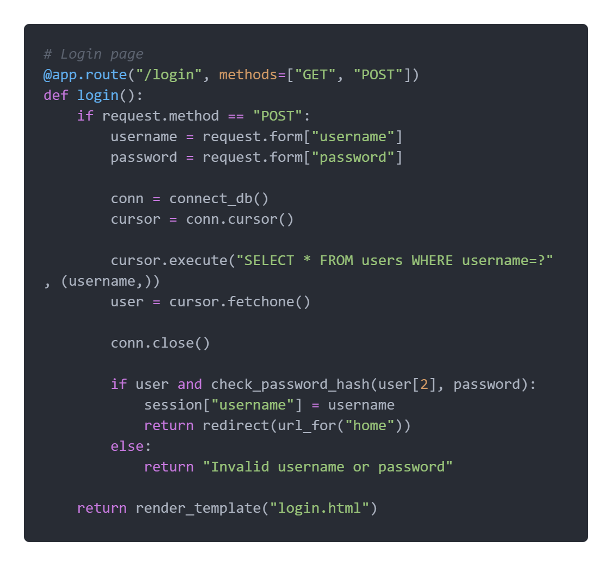
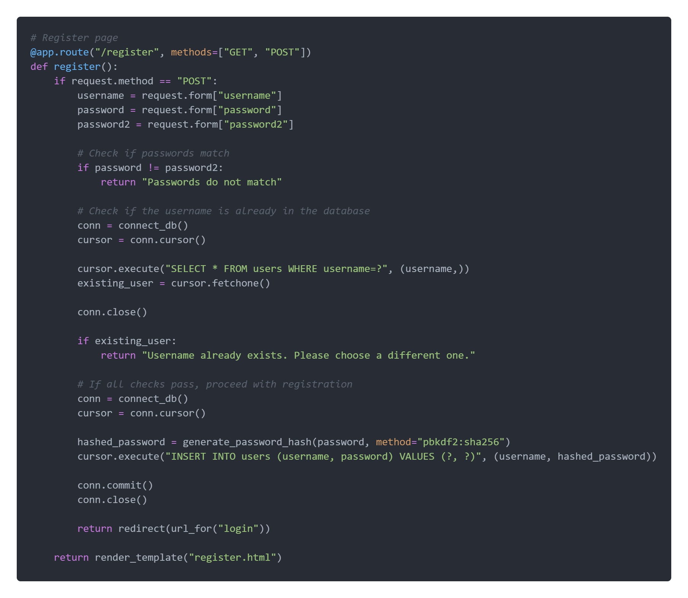

= Gym Tracker App Documentation

== Code Structure

The application is structured as follows:

- **`app.py`**: Contains the main Flask application code.
- **`templates/`**: Contains HTML templates for the different pages.
- **`static/`**: Contains static files such as CSS and JavaScript.
- **`tracker.db`**: SQLite database file to store user, exercise, and workout data.

== Code

[]

[]

```python
@app.route('/register', methods=['GET', 'POST'])
def register():
    if request.method == 'POST':
        username = request.form['username']
        password = request.form['password']
        confirm_password = request.form['confirm_password']
        if password == confirm_password:
            hashed_password = generate_password_hash(password)
            token = secrets.token_hex(16)
            user = User(username=username, password=hashed_password, token=token)
            db.session.add(user)
            db.session.commit()
            return redirect(url_for('login'))
        else:
            return render_template('register.html', error='Passwords do not match')
    return render_template('register.html')
```


== Dependencies

- Flask: Web framework for building the application.
- SQLite: Database management system for storing user, exercise, and workout data.
- Werkzeug: Library for password hashing and verification.
- Secrets: Library for generating secure random tokens.